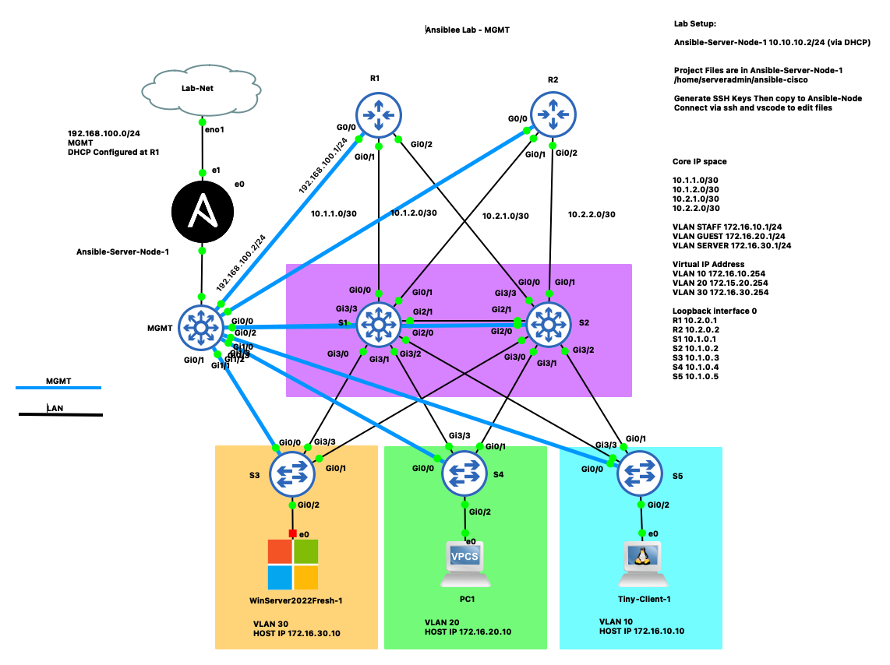

## Ansible Labs using cisco.ios.

#### Lab Topology

## How To start 
- Create topology in emulation software of choice
- build ansible node on Ubuntu 22.04 LTS Server
- lab-launch-config has copy paste configurations for each routing and switching node. 
  

# To do: 
- configure ip space for dist-core and access
- configure vlan
- configure loopback interfaces
- configure internal routing protocols ospf, EIGRP
