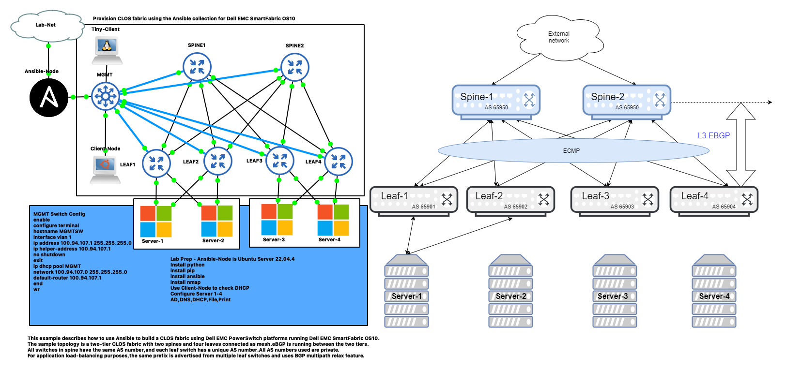

## Dell EMC OS10 Spine Leaf Lab 

#### Lab Topology



## To Do
- Configure Playbooks


## BUGS ##

Dell EMC OS10 virtual images have a firewall issue. The workaround is to login into each Dell EMC OS10 node as linuxadmin and enter the following command:

```
sudo iptables -t filter -I INPUT 2 -p tcp --dport 22 -j ACCEPT
```
